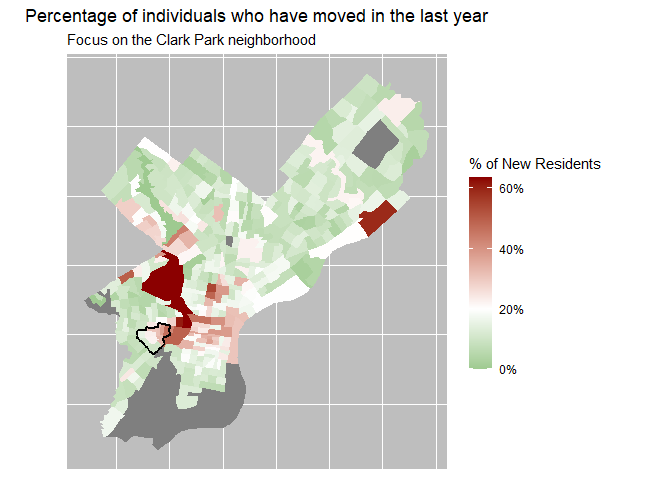

Lab2\_assignment
================
Matt Harris
9/8/2021

``` r
library(tidyverse)
library(tidycensus)
library(sf)
library(tmap) # mapping, install if you don't have it
set.seed(717)
```

This assignment if for you to complete a short version of the lab notes,
but you have to complete a number of the steps yourself. You will then
knit this to a markdown (not an HTML) and push it to your GitHub repo.
Unlike HTML, the RMarkdown knit to `github_document` can be viewed
directly on GitHub. You will them email your lab instructor with a link
to your repo.

Steps in this assignment:

1.  Make sure you have successfully read, run, and learned from the
    `MUSA_508_Lab2_sf.Rmd` Rmarkdown

2.  Find two new variables from the 2019 ACS data to load. Use
    `vars <- load_variables(2019, "acs5")` and `View(vars)` to see all
    of the variable from that ACS. Note that you should not pick
    something really obscure like count\_38yo\_cabinetmakers because you
    will get lots of NAs.

3.  Pick a neighborhood of the City to map. You will need to do some
    googling to figure this out. Use the [PHL Track
    Explorer](https://data-phl.opendata.arcgis.com/datasets/census-tracts-2010/explore?location=40.002759%2C-75.119097%2C11.91)
    to get the `GEOID10` number from each parcel and add them to the
    `myTracts` object below. This is just like what was done in the
    exercise, but with a different neighborhood of your choice. Remember
    that all GEOIDs need to be 10-characters long.

4.  In the first code chunk you will do that above and then edit the
    call-outs in the dplyr pipe sequence to `rename` and `mutate` your
    data.

5.  You will transform the data to `WGS84` by adding the correct EPSG
    code. This is discussed heavily in the exercise.

6.  You will produce a map of one of the variables you picked and
    highlight the neighborhood you picked. There are call-out within the
    `ggplot` code for you to edit.

7.  You can run the code chunks and lines of code as you edit to make
    sure everything works.

8.  Once you are done, hit the `knit` button at the top of the script
    window (little blue knitting ball) and you will see the output. Once
    it is what you want…

9.  Use the `Git` tab on the bottom left of right (depending on hour
    your Rstudio is laid out) and click the check box to `stage` all of
    your changes, write a commit note, hit the `commit` button, and then
    the `Push` button to push it to Github.

10. Check your Github repo to see you work in the cloud.

11. Email your lab instructor with a link!

12. Congrats! You made a map in code!

## Load data from {tidycensus}

``` r
acs_vars <- c(
    "B01001_001",    # ACS total Pop stimat
    "B25002_001",     # stimat of total housing units
    "B25002_003",     # Numbr of vacant housing units
    "B19013_001",    # Mdian HH Incom ($)
    "B02001_002",  # Popl dscribing thmslvs as "whit alon"
    "B07010_001",     # stimat!!Total Individuals
    "B07010_002",  # stimat!!Total:!!No incom
    "B07010_011", # stimat!!Total:!!With incom:!!$75,000 or mor
    "B07010_023",   # stimat!!Total:!!Movd within sam county:
    "B07010_034",  # stimat!!Total:!!Movd from diffrnt county:
    "B07010_045",   # stimat!!Total:!!Movd from diffrnt country:
    "B07010_012"  # Estimate!!Total:!!Same house 1 year ago:
              ) 

myTracts <- c(
    "42101007400", 
    "42101007300", 
    "42101008000", 
    "42101007800", 
    "42101007700",
    "42101008000",
    "42101007900",
    "42101008802", # just west of UPENN
    #"42101036900", # UPENN, hospitals, woodlands
    #"42101008801", # UPENN
    "42101008702",
    "42101008701",
    "42101008601"
              )


acsTractsPHL.2019.sf <- get_acs(geography = "tract",
                             year = 2019,
                             variables = acs_vars,
                             geometry = TRUE,
                             state  = "PA",
                             county = "Philadelphia",
                             output = "wide") %>%
  dplyr::select (GEOID, NAME, all_of(paste0(acs_vars,"E"))) %>%
  rename (
      total_pop.2019 = B01001_001E,    # ACS total Pop estimate
      total_HU.2019 = B25002_001E,     # Estimate of total housing units
      total_vacant.2019 = B25002_003E,     # Number of vacant housing units
      med_HH_income.2019 = B19013_001E,    # Median HH Income ($)
      total_white.2019 = B02001_002E,  # People describing themselves as "white alone"
      total_indi.2019 = B07010_001E,     # Estimate!!Total Individuals
      total_no_income.2019 = B07010_002E,  # Estimate!!Total:!!No income
      total_income_75k.2019 = B07010_011E, # Estimate!!Total:!!With income:!!$75,000 or more
      total_moved_incnty.2019 = B07010_023E,   # Estimate!!Total:!!Moved within same county:
      total_moved_outcnty.2019 = B07010_034E,  # Estimate!!Total:!!Moved from different county:
      total_moved_outusa.2019 = B07010_045E,   # Estimate!!Total:!!Moved from different country:
      total_same_house_1yr.2019 = B07010_012E  # Estimate!!Total:!!Same house 1 year ago:
  ) %>%
  mutate(
    Neighborhood = ifelse(GEOID %in% myTracts,
                               "CLARK PARK",
                               "REST OF PHILADELPHIA"),
    moved_1yr_PCT.2019 = (1 - total_same_house_1yr.2019 / total_indi.2019 )*100
    )
```

## Transform to WGS84 with {sf}

``` r
acsTractsPHL.2019.sf <- acsTractsPHL.2019.sf %>% 
  st_transform(crs = "EPSG:4326")
```

## Plot with {ggplot2}

<!-- -->
